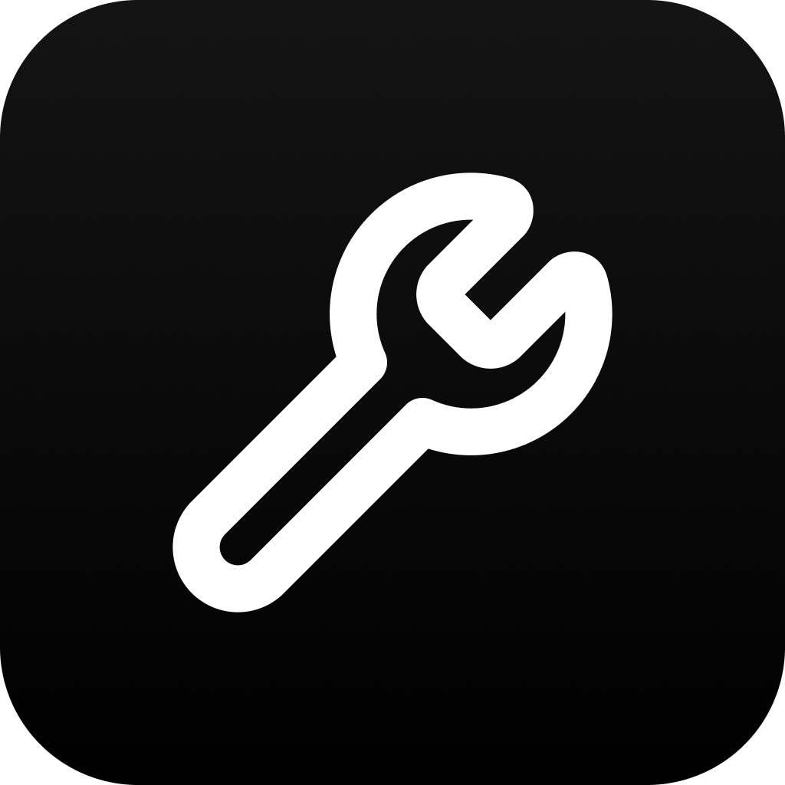

<p align="center">
  
  <h1 align="center">Tools</h1>
</p>

## Tools

- CSS unit converter
- Color converter
- Image converter
- PDF Viewer
- Word counter
- Keyboard tester

## Getting Started

Follow these steps to run the project locally on your machine:

1. Clone the repository.

```bash
git clone https://github.com/nelsonlaidev/tools.git
```

2. Navigate to the project directory.

```bash
cd tools
```

3. Install dependencies.

```bash
pnpm install
```

4. Run the development server.

```bash
pnpm dev
```

---

<p align="center">
Made with ❤️ in Hong Kong
</p>
